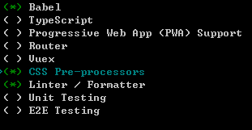
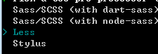
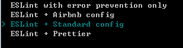
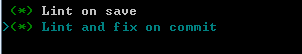
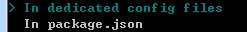
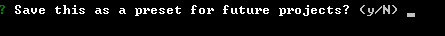
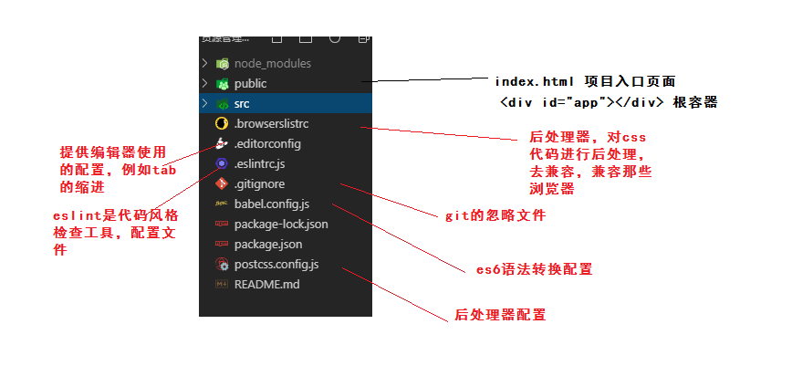
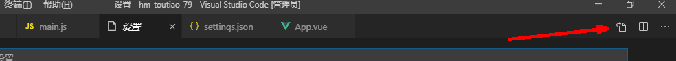
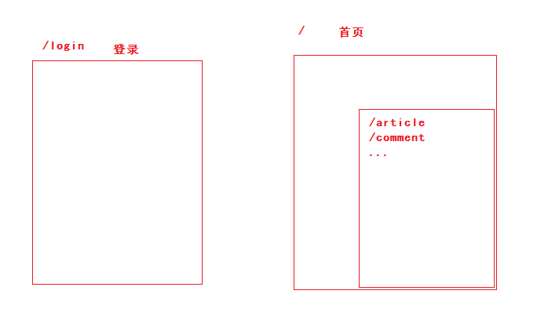

## DAY01-黑马头条PC

### 01-项目-简单介绍

- 今日头条，新闻客户端。不仅是浏览新闻的功能，发布新闻。发布新闻用户，PC管理系统。
- 登录
- 欢迎页面
- 内容管理
- 素材管理
- 发布文章
- 评论管理
- 粉丝管理
- 个人设置


### 02-项目-准备工作

- vue 基础

- vue-router 路由

- vue-cli  脚手架

- axios  请求

- 后台服务在外网   api文档

- element-ui

  - 用户界面 组件库但是有自己样式风格。
  - 饿了么UI  基于VUE最流行的UI组件库
  - 学习  组件的使用套路
  - https://element.eleme.cn/#/zh-CN

  

### 03-项目-初始化

- 是项目的初始化  使用 vue-cli 3.0

```
vue create hm-toutiao-79
```

第一步：选择自定义创建方式


第二步：需要的插件，babel转换ES6   linter使用代码风格检查工具  css预处理器



第三步：选中less



第四步：选择代码风格  standard 标准风格



第五步：检查代码风格的时机  保存的时候校验  提交的时候也校验



第六步：选择刚才的插件的配置存储位置，单独生成文件来记录



第七步：是否保存操作记录  是： 刚才的操作取个名字  否 不记录  n 回车即可。



开始装包...

结束后：

```bash
# 切换目录
cd hm-toutiao-79
# 运行项目
npm run serve 
```


- 配置文件了解：



- **src目录**

```
├─api   接口
├─assets  静态文件
│  └─images
├─components  公用组件
├─directive 指令
├─filter 过滤器
├─router 路由
├─store 本地存储
├─utils 公用工具函数模块
└─views 路由组件
└─App.vue 根组件
└─main.js 入口文件
```

参考即可，目录细分功能，后期好维护。


### 05-项目-分支管理

- 通过vue-cli创建的项目，初始化了git，默认已经做过一次提交。
- 分支功能：
  - 多人协同开发，每个人拥有一个或者多个分支，合并到同一个分支。
  - 单人开发，使用不同的分支开发不同功能，方便管理功能代码。
    - 假如 登录功能
      - git branch login
      - git checkout login
      - 开发 多次提交
        - git add .
        - git commit -m '备注'
        - ...
        - 完毕：
          - git push  远程仓库地址 login  （推送分支）
          - git checkout master （切换分支）
          - git merge login （合并分支）
- 期望：每一次提交记录，github上查看，比对功能实现步骤修改了那些文件。


### 06-项目-使用element-ui

- 安装

```bash
# --save 保存到生产依赖 -S   
# --save-dev  保存到开发依赖 -D
# npm 5.0 版本以上省略  默认安装到生产依赖
npm i element-ui -S
```

- 使用

```diff
import Vue from 'vue';
+import ElementUI from 'element-ui';
+import 'element-ui/lib/theme-chalk/index.css';
import App from './App.vue';

+Vue.use(ElementUI);

new Vue({
  el: '#app',
  render: h => h(App)
});
```

- 验证：

```html
<div id="app">
    App <el-button type="success">成功按钮</el-button>
</div>
```


### 07-项目-配置vscode的eslint插件

- 配置之前：如果使用了格式化插件，在保存的时候不使用这个插件来格式化代码。
- 在设置中加上如下配置即可：

```json
"eslint.validate": [
        "javascript",
        "javascriptreact",
        {
            "language": "html",
            "autoFix": true
        },
        {
            "language": "vue",
            "autoFix": true
        }
    ],
    "eslint.autoFixOnSave": true,
```




### 08-项目-使用vue-router

- 封装router模块
  - 安装  npm i vue-router
  - 导入  import VueRouter from 'vue-router'
  - 注册 
    - import Vue from 'vue'
    - Vue.use(VueRouter )
  - 实例化
    - const router = new VueRouter({routes:[]})
  - 导出
    - export default router
- 使用router模块
  - 导入
  - vue使用中加 router选项即可


### 09-项目-路由规则分析



| 路径       | 功能     | 路由级别 |
| ---------- | -------- | -------- |
| /login     | 登录     | 一级路由 |
| /          | 首页     | 一级路由 |
| └ /        | 欢迎页面 | 二级路由 |
| └ /article | 内容管理 | 二级路由 |
| └ /image   | 素材管理 | 二级路由 |
| └ /publish | 发布文章 | 二级路由 |
| └ /comment | 评论管理 | 二级路由 |
| └ /fans    | 粉丝管理 | 二级路由 |
| └ /setting | 个人设置 | 二级路由 |

### 10-登录模块-路由及组件创建

组件：views/login/index.vue

```html
<template>
  <div class='container'>Login</div>
</template>

<script>
export default {}
</script>

<style scoped lang='less'></style>

```

路由：router/index.js

```diff

const router = new VueRouter({
  // 路由规则
  routes: [
    // name: 'login' 给当前路由取名
    // 跳转使用：$router.push('/login') 或者 $router.push({name:'login'})
+    { path: '/login', name: 'login', component: Login }
  ]
})

```

定义渲染位置：App.vue

```html
  <div id="app">
    <!-- 一级路由的组件显示位置 出口位置  -->
    <router-view></router-view>
  </div>
```


### 11-登录模块-基础布局

- 全屏容器
  - 卡片组件
    - logo

```html
<template>
  <div class='container'>
    <!-- 卡片 element-ui 组件 -->
    <el-card class="my-card">
      
    </el-card>
  </div>
</template>

<script>
export default {}
</script>

<style scoped lang='less'>
.container{
  width: 100%;
  height: 100%;
  position: absolute;
  left: 0;
  top: 0;
  background: url(../../assets/images/login_bg.jpg) no-repeat center / cover;
  .my-card{
    width: 400px;
    height: 350px;
    position: absolute;
    left:50%;
    top:50%;
    transform: translate(-50%,-50%);
    img {
      display: block;
      width: 200px;
      margin: 0 auto;
    }
  }
}
</style>

```

### 12-style标签的scoped的作用

- style scoped lang='less'
- scoped  作用是：让style下的样式仅在当组件下生效
- 当组件
  - 在组件内部出现过的标签  属于当前组件。
  - 俗话：在当前组件暴露的标签
- 原理：
  - data-v-xxxx 的属性  唯一标识
  - 只会给当前组件的标签加上
  - 编译后的样式  .container[data-v-xxxxx]

```css
/* 其他组件的样式 怎么去修改？ */
.el-card__body[data-v-xxxxx]{
  background: green;
}
```

- 结论：定义一个全局样式  styles/index.less

### 13-登录模块-绘制表单

分析：

```html
<!-- el-form 表单容器 -->
<!-- :model="form" form数据  表示整个表单内所有元素的数据集合 -->
<!-- label-width="80px" 统一设置 文章描述 宽度 -->
<el-form ref="form" :model="form" label-width="80px">
  <!-- el-form-item 表单项 label="活动名称" 文字描述-->   
  <el-form-item label="活动名称">
    <!-- 表单元素 -->  
    <el-input v-model="form.name"></el-input>
  </el-form-item>
</el-form>
```

最终代码：

```html
 <!-- 卡片 element-ui 组件 -->
    <el-card class="my-card">
      
      <el-form :model="loginForm">
        <el-form-item>
          <el-input v-model="loginForm.mobile" placeholder="请输入手机号"></el-input>
        </el-form-item>
        <el-form-item>
          <el-input v-model="loginForm.code" placeholder="请输入验证码" style="width:236px;margin-right:10px"></el-input>
          <el-button>发送验证码</el-button>
        </el-form-item>
        <el-form-item>
          <el-checkbox :value="true">我已阅读并同意用户协议和隐私条款</el-checkbox>
        </el-form-item>
        <el-form-item>
          <el-button type="primary" style="width:100%">登 录</el-button>
        </el-form-item>
      </el-form>
    </el-card>
```

总结：使用element-ui组件的方式

- 根据需要找组件
- 看组件的示例，符合需求。
  - 找到：
    - 示例代码
    - 分析代码
    - 自己需求使用
  - 没找到：
    - 参考组件使用文档
      - 属性
      - 事件
      - 函数

