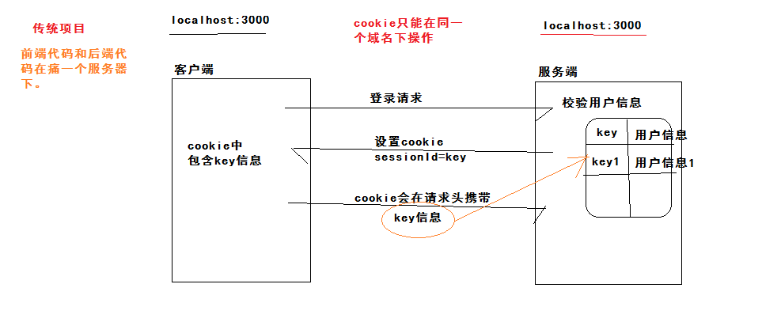
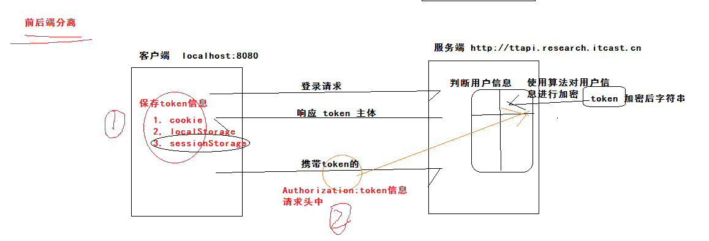
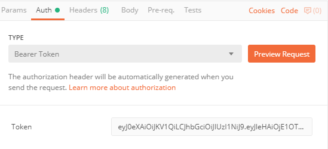
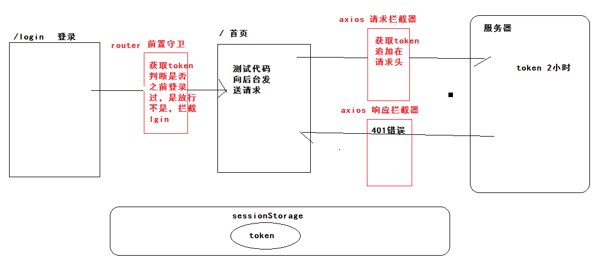

### 01-反馈

| 姓名 | 意见或建议                                                   |
| ---- | ------------------------------------------------------------ |
| ***  | 我可能是个废人了                                             |
| ***  | ref 和 $refs 啥关系                                          |
| ***  | 不要吃榴莲糖 are you ok???                                   |
| ***  | 小酥酥,真给力                                                |
| ***  | 叔叔，不是很清楚什么时候使用属性绑定。o(╥﹏╥)o               |
| ***  | 路由和组件没学好有点懵， 互相来回调的时候不知道怎么弄.       |
| ***  | 老师：`.then(res => { this.$router.push('/') }) .catch(() => { this.$message.error('手机号或验证码有误') }) `代码中 $message,怎么获得的？ |
| ***  | 公元2019年8月23日 阿源创业未半而中道崩殂。 阿源走的第一天，想他。 |
| ***  | 讲的很棒，666                                                |

### 02-回顾

- ref 和 $refs
  - 在vue项目中，获取DOM元素。
  - 在标签加上ref属性，属性的值假设 box , this.$refs.box 即可。
    - ref 写标签上  获取的就是dom
    - ref写在组件上 获取就是组件实例
- 属性绑定作用：
  - v-bind:attr  属性绑定  简写 :attr 
  - 当属性的值需要动态改变的时候
- 回顾
  - 怎么使用element-ui的组件
    - 根据需求找组件
      - 看看示例符合要求
        - 有，示例代码分析
        - 没有，实例下方 还有说明文档
          - 属性
          - 函数
          - 事件
      - 自己来实现。
  - 表单的校验
  - 简单axios使用
  - 首页模块


###03-登录补充-回顾session

- session是服务端的会话存储。



- cookie在同一个域名下才能操作，前后分离的项目，无法使用session的。

###04-登录补充-认识token



- 保存在登录成功的时候，后端返回的token信息。
- 在每次请求的时候，获取token，携带在请求头中。

### 05-登录补充-postman工具



- 发现请求头会携带：
  - Authorization  字段
  - 值： Bearer + 空格 + token

###06-登录补充-回顾本地存储

- sessionStorage 使用
  - getItem(key)
  - setItem(key,value)   value 特点：只能是字符串  json格式字符串
  - removeItem(key)
  - clear()
  - 补充：只能在当前域名下操作。

### 07-登录补充-保存用户信息

封装了模块操作存储：store/index.js

```js
// 提供存储信息的函数  提供获取用户信息的函数  提供删除用户信息的安函数
const KEY = 'hm-toutiao-79-user'
export default {
  setUser (user) {
    // 把user对象存储到sessionStorage
    const jsonStr = JSON.stringify(user)
    window.sessionStorage.setItem(KEY, jsonStr)
  },
  getUser () {
    // 把sessionStorage获取出来，转换对象。
    const jsonStr = window.sessionStorage.getItem(KEY) || '{}'
    // null.abc 报错  {}.abc undefined
    return JSON.parse(jsonStr)
  },
  delUser () {
    // 删除 KEY 对应的数据
    window.sessionStorage.removeItem(KEY)
  }
}

```

在登录逻辑使用：views/login/index.vue

```diff
+ import store from '@/store'
.then(res => {
              // 成功 res 对象响应对象 res.data 主体
              // 保存  用户信息（token） 获取响应主体下data对象
              store.setUser(res.data.data)
+              this.$router.push('/')
            })
```


### 08-登录补充-访问权限控制

- 根据客户端上存储了用户信息来判断是否登录过。
- 访问权限控制
  - 除登录页面外，所有的路由的跳转，都需要做访问权限的控制。
  - 所有的路由跳转前，判断是否存在用户信息。

```js
// 前置导航守卫
const router = new VueRouter({ ... })
router.beforeEach((to, from, next) => {
  // to 去那
  // from 来自
  // next 下一步  next() 放行  next('/login') path 跳转路径
})
```

实现代码：router/index.js

```js
// 前置守卫
router.beforeEach((to, from, next) => {
  const user = store.getUser()
  // 访问的是登录页面：放行
  // 访问的是其他页面且没有做过登录：拦截  登录页面。
  // if (to.path === '/login') return next()
  // if (!user.token) return next('/login')
  // next()
  if (to.path !== '/login' && !user.token) return next('/login')
  next()
})
```


### 09-axios-默认配置选项

- https://www.kancloud.cn/yunye/axios/234845

- baseURL  请求地址的基准地址
- headers 是对象 
  - Authorization  字段
  - 值： Bearer + 空格 + token


代码怎么写：

```js
// 简单配置axios
import axios from 'axios'
// 默认配置  基准地址
axios.defaults.baseURL = 'http://ttapi.research.itcast.cn/mp/v1_0'
// 默认配置  请求头携带token
axios.defaults.headers.Authorization = 'Bearer ' + store.getUser().token
Vue.prototype.$http = axios
```

现象：

- 当你在做登录的时候，是没有存储token的
- 点击登录后才存储了token, 跳转到了首页
- 首页中法了一个请求，并没有获取到token。
- 刷新一下页面，token就获取成功了。
- 原因：main.js入口文件，在页面初始化的时候执行一次，路由跳转不会重新执行main.js的代码。

方案：

- 在每一次请求前，重新获取token，设置给请求头即可。


### 10-axios-请求拦截器

把main.js进行axios配置，封装到了api/index.js

```js
// 负责 配置axios  提供一个配置好的AXIOS即可。
import axios from 'axios'
import store from '@/store'
// 默认配置  基准地址
axios.defaults.baseURL = 'http://ttapi.research.itcast.cn/mp/v1_0'
// 默认配置  请求头携带token
// axios.defaults.headers.Authorization = 'Bearer ' + store.getUser().token
// Vue.prototype.$http = axios

export default axios
```

- 添加请求拦截器  分析

```js
// 添加请求拦截器  分析
axios.interceptors.request.use(function (config) {
    // 在发送请求之前做些什么
    // 加token
    // config 是请求配置  如果你需要额外配置  config进行修改
    // 把修改好的config 返回出去  axios才回使用你修改的配置
    return config;
}, function (error) {
    // 对请求错误做些什么
    // 拦截失败触发  返回promise对象 而且这个失败的promise
    // new Promise() 可能成功可能失败 
    // Promise.reject('错误对象')  失败promise
    // Promise.resolve() 成功promise
    return Promise.reject(error);
});
```

实现功能：api/index.js

```js
// 配置一个请求拦截器(在每次请求的头部加上一个token)
// 每次发送请求之前 执行拦截器
axios.interceptors.request.use((config) => {
  // 拦截成功
  // 加token
  config.headers.Authorization = 'Bearer ' + store.getUser().token
  return config
}, (err) => {
  // 拦截失败 (成功的业务中出现报错)
  return Promise.reject(err)
})
```


### 11-axios-响应拦截器

- token在服务端失效，有有效期（2小时）
- 场景首页：待3小时
  - 发请求获取数据
  - 后台返回错误信息，错误的状态码401，认为本地存储token失效。
  - 跳转到 登录页面 重新登录 获取有效的token。
- 当你每一次发后端给了响应：
  - 判断状态码 401  登录页面 重新登录

```js
// 添加响应拦截器
axios.interceptors.response.use(function (response) {
    // 对响应数据做点什么
    return response;
}, function (error) {
    // 对响应错误做点什么
    // 获取响应状态码  判断是否401
    // error.response 响应对象
    // error.response.status 状态码
    return Promise.reject(error);
});
```

实现功能：api/index.js

```js
// 配置一个响应拦截器（在每次响应失败的时候判断token是否失效）
axios.interceptors.response.use(res => res, err => {
  // err 获取 状态码
  if (err.response.status === 401) {
    // token失效  清除存储token  重新登录
    store.delUser()
    // 登录path 是 '/login'
    // 1. 跳转到登录页面  hash = #/login  使用 location
    // window.location.hash = '#/login'
    // 2. 使用路由来进行跳转
    router.push('/login')
  }
  return Promise.reject(err)
})
```


流程补充：



### 12-axios-async与await使用

- 是ES6提供的新语法，async await 修饰函数的关键字。
  - 让异步的代码书写可以使用同步的方式，逻辑更加清晰，优雅一些。
  - 基于promise对象使用。

- 模拟场景：当你请求A接口返回数据后，再次去请求B接口获取数据。

```js
export default {
  async created () {
    console.log('ok')
    // 使用 promise 方式
    // 调用A
    // this.$http.get('http://localhost:3000/a').then(res => {
    //   console.log(res.data)
    //   // 调用B
    //   return this.$http.get('http://localhost:3000/b')
    // }).then(res => {
    //   console.log(res.data)
    // })

    // 函数的返回值  加载await之后  是then接受的数据
    // 在使用await之后在 外层函数必须用async 来申明
    const resA = await this.$http.get('http://localhost:3000/a')
    const resB = await this.$http.get('http://localhost:3000/b')
    console.log(resA.data, resB.data)
  }
}
```

总结：

- awiat 修饰返回promise对象的函数，结果：得到成功后的数据。
- awiat 使用只能在async修饰的函数内，在awiat的外层函数加上async关键字。
- awiat 修饰的函数 只会阻碍程序运行的，async关键字修饰函数 异步函数。


###13-axios-修改登录异步操作


### 14-首页补充-用户信息


### 15-首页补充-退出登录


