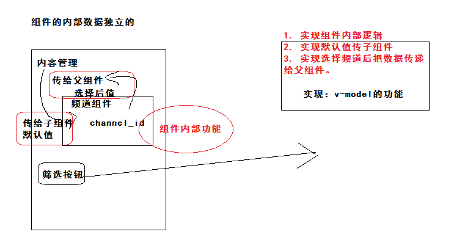

## DAY05-黑马头条PC

### 01-反馈

| 姓名 | 意见或建议                                                   |
| ---- | ------------------------------------------------------------ |
| ***  | 叔叔 你今年有18吗                                            |
| ***  | 艾玛，这给我大兄弟哭的呀，来，擦干眼泪，接着敲(;´༎ຶД༎ຶ`)(;´༎ຶД༎ຶ`)(;´༎ຶД༎ຶ`)烈火英雄 |
| ***  | 很蒙，很迷茫！                                               |
| ***  | 1:为什么components: { ComA }定义的是ComA，但是在div是<com-a></com-a> 2：当我使用了await后，不太清楚在什么地方使用async |
| ***  | 老师，作用域插槽是将封装的子组件中的数据在父组件中使用，子组件向父组件传值也是在父组件中使用的子组件中的数据。两者有什么差别，分别应该在什么场景下使用呢 |
| ***  | 好难呀 看电影不想哭想起学习的事都哭的稀里哗啦的              |
| ***  | 天道不灭，浩气长存                                           |

### 02-回顾

- import ComA from '组件地址'
  - 规范：组配置对象变量名称 遵循驼峰命名
  - components: { ComA }  注册
  - 使用：com-a
- 包裹await的函数需要加上async
- 作用域插槽
  - 传递数据，只能在当前插槽使用
- 子传父
  - 传递数据，父组件任何位置使用


回顾：

- 插槽
  - 默认插槽 slot
  - 备用内容 slot(内容)
  - 具名插槽 slot name
  - 作用域插槽 slot :smg
- 封装面包屑
- 内容管理
  - 筛选布局
  - 结果布局


### 03-内容管理-频道选项渲染

- 组件初始化完毕
  - 获取后台的数据
  - 给channelOptions赋值

```js
// 频道选项数据
channelOptions: [],
```

```js
  created () {
    // 获取频道选项数据
    this.getChannelOptions()
  },
```

```js
methods: {
    async getChannelOptions () {
      const { data: { data } } = await this.$http.get('channels')
      this.channelOptions = data.channels
    }
  }
```

结构：

```html
 <el-option
              v-for="item in channelOptions"
              :key="item.id"
              :label="item.name"
              :value="item.id"
            ></el-option>
```


### 04-内容管理-列表渲染

- 当组件初始化完毕
  - 根据默认的筛选条件进行查询
  - 获取查询的结果数据，给articles赋值。
  - 添加表格的列，进行渲染

```js
 // 文章列表数据
 articles: []
```

```js
created () {
    // 获取频道选项数据
    this.getChannelOptions()
    // 获取文章列表数据
    this.getArticles()
  },
```

```js
async getArticles () {
      // post 请求 post(‘地址’，‘数据’)
      // get 请求 get(‘地址’，‘{params:数据}’)
      const { data: { data } } = await this.$http.get('articles', { params: this.reqParams })
      this.articles = data.results
    }
```

渲染表格的列：

```html
<el-table-column label="封面">
          <template slot-scope="scope">
            <!-- scope.row 数据组件内部传递数据 代表当前行数据（每次遍历的item） -->
            <el-image :src="scope.row.cover.images[0]" fit="cover" style="width:160px;height:100px">
              <div slot="error">
                
              </div>
            </el-image>
          </template>
        </el-table-column>
        <el-table-column prop="title" label="标题"></el-table-column>
        <el-table-column label="状态">
          <template slot-scope="scope">
            <!-- 数据 scope.row.status 值 0 1 2 3 4 代表不同的状态 -->
            <el-tag v-if="scope.row.status===0" type="info">草稿</el-tag>
            <el-tag v-if="scope.row.status===1" >待审核</el-tag>
            <el-tag v-if="scope.row.status===2" type="success">审核通过</el-tag>
            <el-tag v-if="scope.row.status===3" type="warning">审核失败</el-tag>
            <el-tag v-if="scope.row.status===4" type="danger">已删除</el-tag>
          </template>
        </el-table-column>
        <el-table-column prop="pubdate" label="发布时间"></el-table-column>
        <el-table-column label="操作" width="120px">
          <template slot-scope="scope">
            <el-button type="primary" icon="el-icon-edit" circle plain></el-button>
            <el-button type="danger" @click="delArticle(scope.row.id)" icon="el-icon-delete" circle plain></el-button>
          </template>
        </el-table-column>
```


###05-内容管理-分页功能

渲染分页组件

- 获取总条数  data.total_count

```js
// 总条数
total: 0
```

```html
 <div slot="header">根据筛选条件共查询到 {{total}} 条结果：</div>
```

```html
<!-- 分页 -->
      <el-pagination
        class="pager"
        background
        layout="prev, pager, next, total"
        :current-page="reqParams.page"
        :page-size="reqParams.per_page"
        :total="total"
      ></el-pagination>
```

- total  总条数
- page-size 每一页显示条数
- current-page 当前选中第几页


实现分页切换

- 绑定 current-change 事件
- 触发事件的时候获取当前页码
- 发请求即可

```diff
<el-pagination
        class="pager"
        background
        layout="prev, pager, next, total"
        :current-page="reqParams.page"
        :page-size="reqParams.per_page"
        :total="total"
+        @current-change="changePager"
      ></el-pagination>
```

```js
// 切换分页
    changePager (newPage) {
      // 把提交后台的参数改成新的页码
      this.reqParams.page = newPage
      this.getArticles()
    },
```


### 06-内容管理-搜索功能

- 获取需要提交给后台的参数
  - 状态，频道，参数是双向绑定的
  - 时间 和 dateArr 绑定，选择过时间后，去修改reqParams的两个时间。
    - 监听选择日期事件  change
    - 获取选择的时间 [开始，结束] === 回传参数
    - 转换格式
    - 给reqParams的两个时间赋值
- 绑定筛选事件
  - 发请求即可
- 问题：频道清空后，查询全部频道，值为 "" ，是会发送给后台，需要是number
  - 报错处理，当值为 “” 的时候，处理成null

```diff
// 处理日期数据
<el-date-picker
+            @change="changeDate"
            v-model="dateArr"
            type="daterange"
            range-separator="至"
            start-placeholder="开始日期"
            end-placeholder="结束日期"
+            value-format="yyyy-MM-dd"
          ></el-date-picker>
```

```js
// 选择时间
    changeDate (valueArr) {
      if (valueArr) {
        // 给请求参数赋值
        this.reqParams.begin_pubdate = valueArr[0]
        this.reqParams.end_pubdate = valueArr[1]
      } else {
        // 清除请求参数的值
        this.reqParams.begin_pubdate = null
        this.reqParams.end_pubdate = null
      }
    },
```

筛选逻辑：

```html
<el-button type="primary" @click="search">筛选</el-button>
```

```js
// 搜索
    search () {
      // 当你重新查询的时候，当前页码应该第一页。
      this.reqParams.page = 1
      // 数据需要处理 频道数据值为 “” 的时候
      if (this.reqParams.channel_id === '') {
        this.reqParams.channel_id = null
      }
      this.getArticles()
    },
```

```html
<el-select v-model="reqParams.channel_id" placeholder="请选择" clearable>
```


### 07-内容管理-删除-数字最大安全值

- "id": 1166528593157685248  在response中  json文本
- id: 1166528593157685200 在preview中 json对象  (JSON.parse()转换)
  - 在项目中是 axios 默认使用JSON.parse()转换

- 现象原因：后台返回的数字的值 超出了js数字的最大安全值

  - 2的53次方    （Number.MAX_SAFE_INTEGER 获取）
  - JSON.parse() 有误差
  - 数值运算 有误差

- 处理问题：转换的时候改成其他的格式

  - 使用 json-bigint 的js插件
  - 安装  npm i json-bigint 
  - 导包 api/index.js   `var JSONbig = require('json-bigint')`
  - 使用：`JSONbig.parse(json)`
  - 覆盖axios的转换方式，使用上面的方式。

  ```js
  transformResponse: [function (data) {
      // 对 data 进行任意转换处理
      return data;
  }],
  ```

最终代码：api/index.js

```js
import JSONBIG from 'json-bigint'
// 默认配置  转换响应数据
axios.defaults.transformResponse = [data => {
  // 对data（后台的原始数据）进行转换
  return JSONBIG.parse(data)
}]
```


### 08-内容管理-删除-响应无内容处理

- 点击删除按钮
  - 获取文章的ID  （测试帐号删除无效）
  - 请求删除接口
  - 成功后
    - 提示 删除成功
    - 更新 列表

处理没有响应内容：api/index.js

```js
// 默认配置  转换响应数据
axios.defaults.transformResponse = [data => {
  // 对data（后台的原始数据）进行转换
  // 但是 有一些接口  没有任何响应内容
  // JSONBIG.parse(null)  报错
  try {
    return JSONBIG.parse(data)
  } catch (e) {
    return data
  }
}]
```

正常去做删除功能：view/article/index.vue

```html
<el-button
              type="danger"
              @click="delArticle(scope.row.id)"
              icon="el-icon-delete"
              circle
              plain
            ></el-button>
```

```js
 // 删除文章
    delArticle (id) {
      this.$confirm('亲，此操作将永久删除该文章, 是否继续?', '温馨提示', {
        confirmButtonText: '确定',
        cancelButtonText: '取消',
        type: 'warning'
      }).then(async () => {
        // 点击确认触发的函数
        // get 获取数据 post 添加数据 put 完整修改数据 delete 删除数据 patch 局部修改数据
        await this.$http.delete(`articles/${id}`)
        // 代表成功
        this.$message.success('删除成功')
        this.getArticles()
      }).catch(() => {
        // 点击取消触发的函数
      })
    },
```


### 09-内容管理-编辑-地址栏传参跳转

- http://localhost:8080/#/publish 发布文章   path:'/publish'
- http://localhost:8080/#/publish?id=100 编辑文章  path:'/publish'
- 确认传参使用query，因为想两个地址来到同一个组件，路由的规则是一样的。

```html
 <el-button @click="$router.push('/publish?id='+scope.row.id)" type="primary" icon="el-icon-edit" circle plain></el-button>
```


###10-内容管理-频道组件封装-准备



- v-model 是语法糖（简写了一些复杂代码）
  - 赋值  :value="data"  
  - 改值  @input="data=$event"    触发这个事件的元素值
- v-model除了给表单元素使用，可以在任何组件使用。
  - 父传子  props
  - 子传父  $emit('事件名称'，数据)
    - 父组件给组件绑定自定义事件  <com-a @abc="fn">
    - 子组件触发事件，this.$emit('abc','数据')

父组件

```html
<template>
  <div class='container'>
    {{parentMsg}}
    <com-b @abc="fn"></com-b>
  </div>
</template>

<script>
import ComB from '@/components/com-b'
export default {
  data () {
    return {
      parentMsg: ''
    }
  },
  methods: {
    // @abc 事件属于 com-b 的自定义事件
    // 遵循：事件给谁绑定，谁负责触发
    // fn 父组件申明  函数是可以传参
    fn (data) {
      // 事件对应函数
      this.parentMsg = data
    }
  },
```

子组件

```html
<template>
  <div class='container'>COM-B <button @click="fn1()">提交数据给父组件</button> </div>
</template>

<script>
export default {
  data () {
    return {
      msg: 'COM-B的数据'
    }
  },
  methods: {
    fn1 () {
      // 提交数据给父组件
      this.$emit('abc', this.msg)
    }
  }
}
```


### 11-内容管理-频道组件封装-实现
