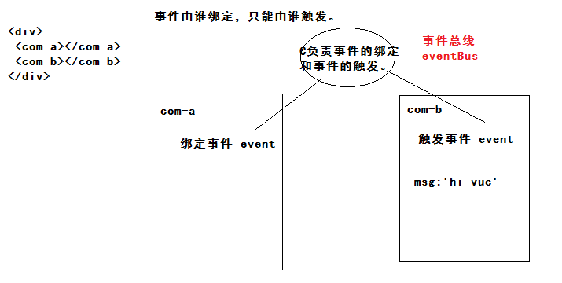

## 黑马头条后台管理项目-DAY08

### 01-反馈

| 姓名 | 意见或建议                                                   |
| ---- | ------------------------------------------------------------ |
| ***  | 老师给点好的学习方法把，学习的效率有点低，一天这么多个自习，发现时间还是不够用，谢谢老师， 不要敷衍我哦 |
| ***  | 我右边的同桌是个傻子，略略略~~~                              |
| ***  | 真不喜欢写反馈。。。。。。。。没办法，不写抄单词。悲哀。。。。。。。。。。。。。。 |
| ***  | 吾日三省吾身,前日不会,昨日不会,今日还不会                    |
| ***  | 项目逻辑 不知道怎么弄代码表示。。。                          |
| ***  | 万物皆需，万事皆允                                           |
| ***  | 啥也不是                                                     |

- 什么程度叫学会了？
  - 独立的完成当天的代码。
  - 先看笔记（视频），对照笔记，敲出代码，认为吸收一半。
  - 自己独立的再来次。

### 02-回顾（作业）

- 发布文章
  - 使用富文本
  - 封装封面图组件
  - 发布业务
  - 合并修改业务
- 作业：解决当你在修改文章时候，点击发布文章，组件不更新。
  - 原因：路由对应的组件，路由规则发生改变，组件就会更新。
  - 思路：监听地址栏传参的改变，手动更新组件（更新数据）
    - $route.query.id 获取的传参 （修改   有值 ----> 无值  发布）
    - 需要是基础知识：watch  侦听器

- 回顾
  - 计算属性：
    - 当你需要的数据，需要依赖data中的数据，且经过复杂逻辑的处理才能得到，此时使用。
    - 特点：当你依赖的数据发生改变，计算属性也会改变。
    - 一定需要返回值。
  - 侦听器：
    - 监听到一项数据（通过this使用的所有数据）的变化。
    - 适合：在异步操作或者开销较大操作 （当然任何操作都使用watch）
    - 总结：监听数据变化的时候，去干一些事情。

语法：

```js
new Vue({
    data(){
        return {
            msg:'',
        }
    },
    watch:{
        // msg 就是的名字
        msg:function(newVal,oldVal){
            // 当msg对应的数据发生改变触发
        }    
    }
})
```

使用：‘’$route.query.id“:function(){}  监听到对象下属性变化。

```js
watch: {
    // 监听地址栏ID传参变化
    '$route.query.id': function (newVal, oldVal) {
      console.log(newVal, oldVal)
      // 修改切到发布的时候  重置文章数据 清空文章ID
      this.articleForm = {
        title: '',
        content: '',
        cover: {
          type: 1,
          images: []
        },
        channel_id: null
      }
      this.articleId = null
    }
  },
```


### 03-评论管理-基础布局

```html
<template>
  <div class='container'>
    <el-card>
      <div slot="header">
        <my-bread>评论管理</my-bread>
      </div>
      <!-- 表格 -->
      <el-table :data="articles">
        <el-table-column label="标题"></el-table-column>
        <el-table-column label="总评论数"></el-table-column>
        <el-table-column label="粉丝评论数"></el-table-column>
        <el-table-column label="状态"></el-table-column>
        <el-table-column label="操作"></el-table-column>
      </el-table>
      <!-- 分页 -->
    </el-card>
  </div>
</template>

<script>
export default {
  data () {
    return {
      articles: []
    }
  }
}
</script>

<style scoped lang='less'></style>

```


### 04-评论管理-列表与分页

列表

```html
 <!-- 表格 -->
      <el-table :data="articles">
        <el-table-column label="标题" prop="title" width="400px"></el-table-column>
        <el-table-column label="总评论数" prop="total_comment_count"></el-table-column>
        <el-table-column label="粉丝评论数" prop="fans_comment_count"></el-table-column>
        <el-table-column label="状态">
          <template slot-scope="scope">
            {{scope.row.comment_status?'正常':'关闭'}}
          </template>
        </el-table-column>
        <el-table-column label="操作" width="120px">
          <template slot-scope="scope">
            <el-button v-if="scope.row.comment_status" type="danger" size="small">关闭评论</el-button>
            <el-button v-else type="success" size="small">打开评论</el-button>
          </template>
        </el-table-column>
      </el-table>
```

```js
 articles: [],
```

```js
created () {
    this.getArtciles()
  },
  methods: {
    async getArtciles () {
      const { data: { data } } = await this.$http.get('articles', { params: this.reqParams })
      this.articles = data.results
    }
  }
```

分页

```html
<!-- 分页 -->
      <el-pagination
        style="text-align:center;margin-top:20px"
        background
        layout="prev, pager, next"
        :total="total"
        :page-size="reqParams.per_page"
        :current-page="reqParams.page"
        @current-change="changePager"
        hide-on-single-page
      ></el-pagination>
```

```js
 total: 0,
```

```js
changePager (newPage) {
      this.reqParams.page = newPage
      this.getArtciles()
    },
```


### 05-评论管理-打开与关闭

```html
<template slot-scope="scope">
            <el-button @click="toggleStatus(scope.row)" v-if="scope.row.comment_status" type="danger" size="small">关闭评论</el-button>
            <el-button @click="toggleStatus(scope.row)" v-else type="success" size="small">打开评论</el-button>
          </template>
```

```js
// 打开或关闭评论
    async toggleStatus (row) {
      const { data: { data } } = await this.$http.put(`comments/status?article_id=${row.id}`, {
        allow_comment: !row.comment_status
      })
      // 成功后  提示 + 更新列表（更新当前行评论状态即可）
      this.$message.success(data.allow_comment ? '打开评论成功' : '关闭评论成功')
      row.comment_status = data.allow_comment
    },
```


### 06-VUE基础-组件传值(非父子)

- 父传子
- 子传父
- 非父子
  - 在A组件内绑定一个事件（C.$on('事件名称'，函数（参数）｛｝)），当事件被触发，接收传参。
  - 在B组件内触发这个事件（C.$emit(‘事件名称’，‘数据’)），触发这个事件，传参即可。
  - 这个事件，由C绑定，由C触发。（术语：事件总线eventBus-控制了组件传值需要使用的所有事件绑定和触发）



对应的实现：

eventBus.js

```js
// 提供C  事件总线 eventBus（负责任何组件之间的传值需要的  事件绑定和事件触发）
import Vue from 'vue'
export default new Vue()
```

com-a.vue   需要数据 绑定事件

```js
import eventBus from './eventBus'
export default {
  created () {
    eventBus.$on('b2a', (data) => {
      // 得到了数据 data 
    })
  }
}
```

com-b.vue  传递数据 触发事件

```js
import eventBus from './eventBus'
export default {
  methods: {
    fn2 () {
      // 传递数据给A组件
      eventBus.$emit('b2a', '数据')
    }
  }
}
```


### 07-个人设置-基础布局

```html
<template>
  <div class='container'>
    <el-card>
      <div slot="header">
        <my-bread>个人设置</my-bread>
      </div>
      <!-- 栅格 -->
      <el-row>
        <el-col :span="12">
          <!-- 表单 -->
          <el-form label-width="120px">
            <el-form-item label="编号：">1</el-form-item>
            <el-form-item label="手机号：">13200002222</el-form-item>
            <el-form-item label="媒体名称：">
              <el-input v-model="userInfo.name"></el-input>
            </el-form-item>
            <el-form-item label="媒体介绍：">
              <el-input v-model="userInfo.intro" type="textarea" :rows="3"></el-input>
            </el-form-item>
             <el-form-item label="邮箱：">
              <el-input v-model="userInfo.email"></el-input>
            </el-form-item>
            <el-form-item>
              <el-button type="primary">保存设置</el-button>
            </el-form-item>
          </el-form>
        </el-col>
        <el-col :span="12">
          <!-- 上传组件 -->
          <el-upload
            class="avatar-uploader"
            action="https://jsonplaceholder.typicode.com/posts/"
            :show-file-list="false">
            
            <i v-else class="el-icon-plus avatar-uploader-icon"></i>
          </el-upload>
          <p style="text-align:center;font-size:14px">修改头像</p>
        </el-col>
      </el-row>
    </el-card>
  </div>
</template>

<script>
export default {
  data () {
    return {
      userInfo: {
        name: '',
        intro: '',
        email: ''
      },
      imageUrl: null
    }
  }
}
</script>

<style scoped lang='less'></style>

```


### 08-个人设置-修改基本信息

获取个人信息填充表单

```js
 created () {
    // 获取个人信息
    this.getUserInfo()
  },
  methods: {
    async getUserInfo () {
      const { data: { data } } = await this.$http.get('user/profile')
      this.userInfo = data
    }
  }
```

添加photo字段在修改头像使用：

```js
photo: ''
// imageUrl: null
```

```html

```


修改后进行数据提交

- 点击保存设置的时候
  - 把修改后的数据提交给后台
  - 成功：
    - 提示
    - 本地存储  用户名称需要修改
    - home组件 用户名称需要修改

```js
<el-button type="primary" @click="save">保存设置</el-button>
```

```js
async save () {
      const { name, intro, email } = this.userInfo
      await this.$http.patch('user/profile', { name, intro, email })
      // 成功
      this.$message.success('修改用户信息成功')
      // 更新本地存储的用户名称
      const user = store.getUser()
      user.name = name
      store.setUser(user)
      // 更新HOME组件的用户名称
      eventBus.$emit('updateName', name)
    },
```

home组件绑定事件：views/home.vue

```diff
+   import eventBus from '@/components/eventBus'
 created () {
    const user = store.getUser()
    this.name = user.name
    this.photo = user.photo
    // 绑定事件 接受名字数据
+    eventBus.$on('updateName', (name) => {
+      this.name = name
+    })
  },
```


### 09-个人设置-修改头像

- 修改头像提交的图片 请求方式patch
- 而el-upload组件默认的提交方式是post
- 不能使用默认的上传方式，自定义上传。
  - 上传图片的请求需要自己来发送。
    - 大事件 上传图片 方案：xhr+formdata
    - 黑马头条  上传图片 方案：axios+formdata
- 使用 http-request 属性来覆盖默认上传
  - 指定是function ，当你选择了图片后触发

```html
 <el-upload
            class="avatar-uploader"
            action=""
            :show-file-list="false"
            :http-request="upload"
          >
            
            <i v-else class="el-icon-plus avatar-uploader-icon"></i>
          </el-upload>
```

进行上传

```js
 // 当你选择了图片后触发  有传参
    async upload (result) {
      // console.log(result.file) 就是选中的图片
      // 通过axios和formdata提交图片
      const formData = new FormData()
      // 往formData追加图片
      formData.append('photo', result.file)
      const { data: { data } } = await this.$http.patch('user/photo', formData)
      // 上传成功
      this.$message.success('修改头像成功')
      // 预览
      this.userInfo.photo = data.photo
      // 更新本地存储的头像
      const user = store.getUser()
      user.photo = data.photo
      store.setUser(user)
      // 更新Home组件的头像
      eventBus.$emit('updatePhoto', data.photo)
    },
```

home组件绑定事件：views/home.vue

```js
eventBus.$on('updatePhoto', (photo) => {
      this.photo = photo
    })
```


### 10-粉丝管理-基础布局


### 11-粉丝管理-粉丝列表


### 12-粉丝管理-echarts使用

